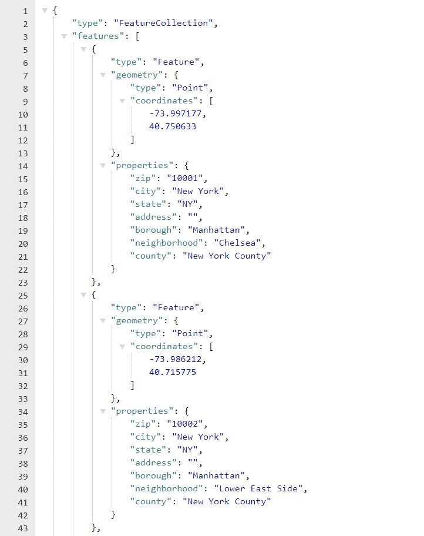
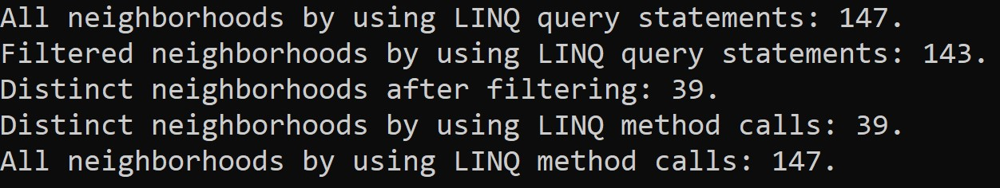

# Lab09-LINQ 
## Summary
This is a program that reads data from an external file(json file), then performs some filtering on specified values using LINQ query statements and LINQ method calls.

## Visuals
This json file consists of objects and properties, for an example, it has a type and an array of objects call features, and each object has objects inside along with it's properties. What I did is reading this file, then I did some LINQ method calls and queries. Below is a part of the data.json file image:

---
Below is an image of the number of neighborhoods after performing LINQ query statements or LINQ method calls. To view the retrieved, uncomment the foreach loop inside my solution, then click run or F5. I did that because we have a lot of values and the picture won't fit.

---

## How to run the project
First download the folder. Then, open the solution file. Finally, run the file by clicking on play button or press F5 after 